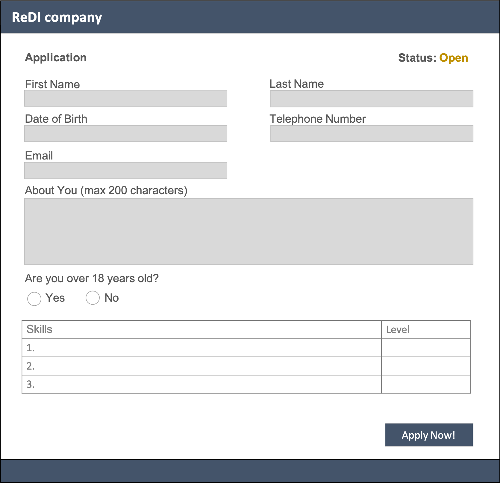

# fed-homework-14-lesson
Homework regarding to practice form validation

1. Implement a job application form or something similar like a contact form for your project. You should add the form on a new individual page.
Use the mockup below as a starting point. Make sure to include different input options like textareas or radio buttons, or check boxes. 
2. Also add a paragraph somewhere on the page (e.g. the status infor in the example). It's content/text should be changed once you submit the form. Use DOM manipulatioon for that.
3. Add form validation to ensure that the user inserts correct data. In the given example this implies that: 

* All fields except skills table are required
* Email must be valid
* Length of "About You" section is restricted
* Name fileds can only contain strings
* Phone number must be numers only
* Date of birth must be valid

